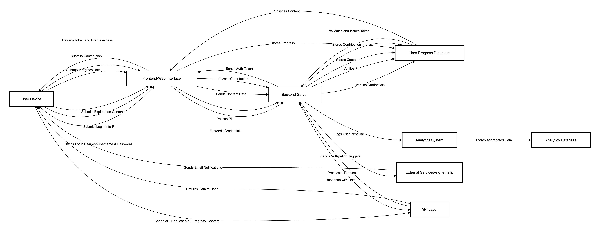
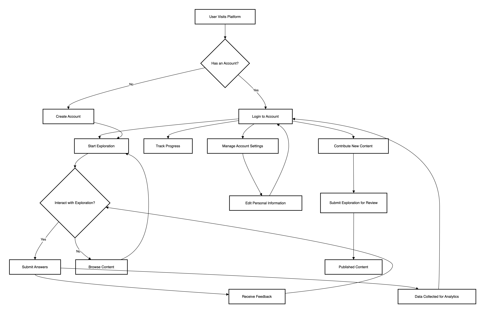
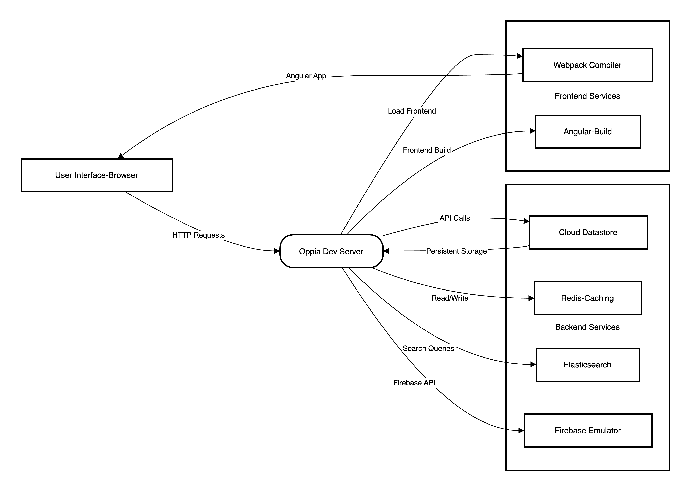

#### Tasks for 21rst of October

1. Description of application and high level privacy issues.  
2. Screenshot of the project running from source.

**Description**

Oppia is a web-based (for this project we do not study the MobileApp), open-source e-learning platform aimed at making education accessible to all. It focuses on providing an engaging experience for learners through "explorations," which are interactive lessons designed to simulate one-on-one tutoring by adjusting to the learner's responses and offering feedback accordingly.

The platform is built using Python and AngularJS/Angular, and it leverages Google App Engine for hosting when deployed for production. Oppia's framework is built for simplicity, placing a focus on community involvement by enabling users to develop new content or edit existing lessons.

Oppia is licensed under an open-source Apache 2.0 license, encouraging collaborative development. Its business model is primarily community-driven with no commercial intent, though donations and contributions to the platform are welcomed to support ongoing development and maintenance.

**Data Collection and Privacy**

The Site is designed to be open and free, which means that people do not have to register, create an account or sign in to use the Site. If the user does choose to register with the Site, Oppia collects certain information that identifies the user as an individual or relates to the user as an identifiable person ("Personal Information"), including: 
- the email address;
- the user name;
- the photo (if uploaded); and
- any other Personal Information the user submits to Oppia during its profile registration process ("Profile Information") or on any forms or other input fields on the Site.

Personal Information may used: 
- to respond to the user's inquiries and fulfill its requests, such as to send updates regarding the Site; 
- to send administrative information to the user, such as information regarding the Site and changes to our terms, conditions, and policies; 
- to send information about the Site and other offerings;
- to provide with technical support and customer service;
- to personalize the user experience on the Site by suggesting new educational activities, including but not limited to the Explorations, Collections and Questions accessible on the Site (the "Lessons"), for the user to try and by helping to track its progress; 
- to allow the user to provide feedback to and receive feedback from other users on Lessons; 
- to allow the user to participate in contests and similar promotions and to administer these activities, some of which may have additional rules about how Oppia use and disclose the user's Personal Information;
- to facilitate social sharing functionality; and
- for our business purposes, such as data analysis, audits, fraud monitoring and prevention, developing new products, providing technical fixes, enhancing, improving or modifying our products or services, identifying usage trends, determining the effectiveness of our promotional campaigns and operating and expanding our business activities.

"Other Information" is information that does not reveal the user specific identity or does not relate to the user as an identifiable person, including: 
- "Usage Data", such as: 
    - its answers to Lessons;
    - when the user begins and ends a Lesson;
    - when the user visit the site;
    - what pages the user visit while using the Site;
    - the page from which the user navigated to the Site and the page to which the user navigates when the user leaves the Site; 
    - any playthrough-specific customizations to a Lesson (such as randomly generated parameters); 
    - any contributions the user make to the Site (such as feedback on Lessons, edits to Lessons, and Lessons created); 
- browser and device information, such as: 
    - the IP address of the computer used to access the Site;
    - what browser or device the user is using to visit the Site;
    - what operating system the user is using;
- information collected through cookies, pixel tags and other technologies; 
- demographic information and other information disclosed by the user; and 
- aggregated information

**High Level Privacy Issue**

DEPENDS ON THE STORY

**Platform Architecture**

Oppia's platform architecture consists of several layers:
1. Frontend: AngularJS/Angular manages user interactions and interface rendering.
2. Backend: Python, hosted on Google App Engine, handles the business logic and APIs.
3. Database: Google Cloud Datastore stores data such as user information, lesson progress, and feedback.
4. Authentication: User authentication is handled via OAuth 2.0, allowing users to sign in securely with Google.
5. Services Layer: RESTful APIs connect the frontend and backend, facilitating data flow.

The diagram represents the data flow and interactions between a user device, the frontend interface, backend server, and supporting systems in the Oppia platform:
1. User Device: The user initiates interactions such as logging in, submitting exploration content, or making progress contributions.
2. Frontend-Web Interface: This serves as the intermediary between the user device and the backend, passing user credentials for login, content submissions, and progress data.
3. Backend-Server: The backend handles key functions, including verifying user credentials, processing personal information (PII), storing content, and progress data. It sends necessary tokens for user authentication and passes processed data to other subsystems.
4. User Progress Database: Stores user contributions and progress throughout their engagement with the platform.
5. Analytics System: Logs user behavior to analyze platform usage, which is stored in the Analytics Database for further insights.
6. API Layer: Handles requests and data exchange between different systems, such as fetching content or progress data from external services.
7. External Services: Includes systems like email notifications triggered by the backend.

**User-Platform Interactions**

The diagram outlines how users interact with the Oppia platform. Users either log in or create an account and can start an educational "exploration." They interact by submitting answers, receiving feedback, and browsing content. Logged-in users can track progress, manage settings, and contribute by submitting new explorations. Data from interactions is collected for analytics to enhance the learning experience. The process focuses on user-driven exploration and content contribution.

**Services Interactions**

Oppia's platform is structured around a monolithic architecture (Dev Server handles most of the operations) but has external services. The diagram illustrates how thes services interact with each other:

1. User Interface: Users interact with Oppia via a browser, sending HTTP requests to the Oppia Dev Server.
2. Oppia Dev Server: Acts as the central hub, processing user requests and managing data flow between frontend and backend services. It retrieves data from:
	   - Cloud Datastore for persistent storage of lessons and user data.
	   - Redis for quick caching of frequently accessed data.
	   - Elasticsearch for fast search queries (indexing).
	   - Firebase Emulator for real-time services during development.
3. Frontend Services: 
   - Webpack Compiler and Angular-Build compile and optimize the user-facing application, delivering it to the browser efficiently.

